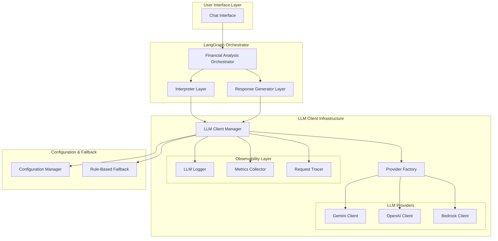

# LLM Client Integration - Design Document

## Overview

This design document outlines the implementation of a provider-agnostic LLM client infrastructure that enables real language model capabilities in the financial analysis system. The design replaces placeholder logic in existing interpreters and response generators with actual LLM functionality while maintaining backward compatibility and providing comprehensive observability.

The implementation follows a layered architecture that integrates seamlessly with the existing LangGraph orchestrator, providing multiple LLM provider support through LangChain APIs with robust error handling, fallback mechanisms, and comprehensive monitoring.

## Architecture

### High-Level Architecture



### Integration Points

The LLM client infrastructure integrates with existing components:

1. **Interpreter Layer**: Replaces placeholder `LLMInterpreter` with real LLM-powered interpretation
2. **Response Generator Layer**: Replaces placeholder `LLMResponseGenerator` with actual LLM response generation
3. **Configuration System**: Extends existing configuration with LLM provider settings
4. **Logging Infrastructure**: Integrates with existing logging for comprehensive observability

## Components and Interfaces

### 1. LLM Client Manager

**Purpose**: Central coordinator for all LLM interactions with provider abstraction and observability.

**Key Responsibilities**:
- Provider selection and routing
- Request/response lifecycle management
- Error handling and fallback coordination
- Observability data collection
- Configuration management

**Interface**:
```python
class LLMClientManager:
    # Synchronous methods
    def interpret_request(
        self, 
        user_input: str, 
        context: Dict[str, Any] = None,
        correlation_id: str = None
    ) -> RequestInterpretation
    
    def generate_response(
        self, 
        response_context: ResponseContext,
        correlation_id: str = None
    ) -> str
    
    # Asynchronous methods with streaming support
    async def async_interpret_request(
        self, 
        user_input: str, 
        context: Dict[str, Any] = None,
        correlation_id: str = None,
        streaming_callback: Optional[Callable] = None
    ) -> RequestInterpretation
    
    async def async_generate_response(
        self, 
        response_context: ResponseContext,
        correlation_id: str = None,
        streaming_callback: Optional[Callable] = None
    ) -> str
    
    def get_provider_health(self) -> Dict[str, ProviderHealth]
    def get_usage_metrics(self) -> UsageMetrics
```

### 2. Provider Factory

**Purpose**: Creates and manages LLM provider client instances with configuration validation.

**Key Responsibilities**:
- Provider client instantiation
- Configuration validation
- Provider capability detection
- Health check coordination

**Interface**:
```python
class LLMProviderFactory:
    def create_provider(self, provider_type: str, config: Dict) -> BaseLLMProvider
    def get_available_providers(self) -> List[str]
    def validate_provider_config(self, provider_type: str, config: Dict) -> bool
    def validate_provider_capabilities(
        self, 
        provider_type: str, 
        required_capabilities: List[str]
    ) -> bool
```

### 3. Base LLM Provider

**Purpose**: Abstract interface for all LLM providers ensuring consistent behavior.

**Key Responsibilities**:
- Standardized LLM interaction interface
- Provider-specific configuration handling
- Error handling and retry logic
- Usage tracking

**Interface**:
```python
class BaseLLMProvider(ABC):
    # Synchronous methods
    @abstractmethod
    def interpret_request(self, prompt: str, context: Dict) -> InterpretationResult
    
    @abstractmethod
    def generate_response(self, prompt: str, context: Dict) -> ResponseResult
    
    # Asynchronous methods with streaming support
    @abstractmethod
    async def async_interpret_request(
        self, 
        prompt: str, 
        context: Dict,
        streaming_callback: Optional[Callable] = None
    ) -> InterpretationResult
    
    @abstractmethod
    async def async_generate_response(
        self, 
        prompt: str, 
        context: Dict,
        streaming_callback: Optional[Callable] = None
    ) -> ResponseResult
    
    # Provider metadata and capabilities
    @abstractmethod
    def capabilities(self) -> ProviderCapabilities
    
    @abstractmethod
    def get_health_status(self) -> ProviderHealth
    
    @abstractmethod
    def get_usage_stats(self) -> ProviderUsage
```

### 4. Provider Implementations

#### Gemini Client
- Uses `langchain-google-genai` integration
- Supports Gemini Pro and Gemini Pro Vision models
- Handles Google-specific authentication and rate limiting

#### OpenAI Client
- Uses `langchain-openai` integration
- Supports GPT-4, GPT-3.5-turbo models
- Handles OpenAI API key authentication and usage tracking

#### Bedrock Client
- Uses `langchain-aws` integration
- Supports Claude, Titan, and other Bedrock models
- Handles AWS authentication and regional configuration

### 5. Observability Components

#### LLM Logger
**Purpose**: Comprehensive logging of all LLM interactions with correlation tracking and PII protection.

**Features**:
- Structured logging with correlation IDs
- **PII-filtered request/response logging using `redact_sensitive()` helper**
- Performance timing and metadata
- Error context and fallback tracking
- **OpenTelemetry trace integration**
- **Configurable log levels for cost control**

#### Metrics Collector
**Purpose**: Cost-aware metrics collection for monitoring and budget control.

**Metrics Tracked**:
- Request count and success rates per provider
- Response time percentiles
- **Token usage and cost estimation with budget tracking**
- **Daily/monthly cost accumulation**
- Error rates and types
- Fallback activation rates
- **Budget utilization percentage**

#### Request Tracer
**Purpose**: End-to-end request tracing for debugging and audit with OpenTelemetry integration.

**Features**:
- **Correlation ID generation and propagation (documented in `docs/OBSERVABILITY.md`)**
- Request flow tracking through orchestrator
- LLM interaction timeline
- Context preservation across calls
- **OpenTelemetry span creation and propagation**
- **Export to GCP Cloud Monitoring and AWS CloudWatch**

## Data Models

### Configuration Models

**Integration**: Moved to `config/settings.py` with environment variable sourcing

```python
@dataclass
class LLMProviderConfig:
    provider_type: str
    model_name: str
    api_key: Optional[str]
    base_url: Optional[str]
    temperature: float = 0.7
    max_tokens: int = 1000
    timeout: int = 30
    retry_attempts: int = 3
    enabled: bool = True
    capabilities: List[str] = field(default_factory=list)

@dataclass
class LLMClientConfig:
    default_provider: str
    providers: Dict[str, LLMProviderConfig]
    fallback_enabled: bool = True
    observability_enabled: bool = True
    cost_tracking_enabled: bool = True
    async_enabled: bool = True
    streaming_enabled: bool = True

@dataclass
class ProviderCapabilities:
    chat: bool = True
    completion: bool = True
    streaming: bool = False
    async_support: bool = False
    function_calling: bool = False
    vision: bool = False
```

### Observability Models

```python
@dataclass
class LLMInteractionLog:
    correlation_id: str
    timestamp: datetime
    provider: str
    model: str
    operation: str  # 'interpret' or 'generate'
    request_tokens: int
    response_tokens: int
    duration_ms: int
    success: bool
    error_message: Optional[str]
    fallback_used: bool

@dataclass
class ProviderHealth:
    provider: str
    status: str  # 'healthy', 'degraded', 'unhealthy'
    last_success: datetime
    error_rate: float
    avg_response_time: float
    
@dataclass
class UsageMetrics:
    total_requests: int
    successful_requests: int
    total_tokens: int
    estimated_cost: float
    avg_response_time: float
    provider_breakdown: Dict[str, ProviderUsage]
```

### LLM Response Models

```python
@dataclass
class InterpretationResult:
    interpretation: RequestInterpretation
    confidence: float
    provider_used: str
    tokens_used: int
    processing_time: float
    fallback_used: bool

@dataclass
class ResponseResult:
    response_text: str
    provider_used: str
    tokens_used: int
    processing_time: float
    fallback_used: bool
```

## Error Handling

### Error Hierarchy

**File**: `llm/errors.py`

```python
class LLMClientError(Exception):
    """Base exception for LLM client errors"""
    def __init__(self, message: str, provider: str = None, retry_after: int = None):
        super().__init__(message)
        self.provider = provider
        self.retry_after = retry_after

class LLMProviderUnavailableError(LLMClientError):
    """Provider is temporarily unavailable"""
    pass

class LLMConfigurationError(LLMClientError):
    """Invalid configuration provided"""
    pass

class LLMRateLimitError(LLMClientError):
    """Rate limit exceeded"""
    pass

class LLMAuthenticationError(LLMClientError):
    """Authentication failed"""
    pass

class LLMTimeoutError(LLMClientError):
    """Request timeout exceeded"""
    pass

class LLMQuotaExceededError(LLMClientError):
    """Usage quota exceeded"""
    pass

# Error-to-retry policy mapping
ERROR_RETRY_POLICIES = {
    LLMRateLimitError: {"retryable": True, "backoff": "exponential", "max_attempts": 3},
    LLMTimeoutError: {"retryable": True, "backoff": "linear", "max_attempts": 2},
    LLMProviderUnavailableError: {"retryable": True, "backoff": "exponential", "max_attempts": 3},
    LLMAuthenticationError: {"retryable": False, "backoff": None, "max_attempts": 0},
    LLMConfigurationError: {"retryable": False, "backoff": None, "max_attempts": 0},
    LLMQuotaExceededError: {"retryable": False, "backoff": None, "max_attempts": 0},
}
```

### Fallback Strategy

1. **Primary Provider Failure**: Retry with exponential backoff
2. **Persistent Provider Failure**: Switch to secondary provider
3. **All Providers Failed**: Fall back to rule-based processing
4. **Configuration Error**: Use safe defaults and log warnings

### Circuit Breaker Pattern

Implement circuit breaker for each provider:
- **Closed**: Normal operation
- **Open**: Provider marked as failed, immediate fallback
- **Half-Open**: Testing provider recovery

## Testing Strategy

### Unit Testing

1. **Provider Clients**: Mock LangChain integrations
2. **LLM Manager**: Mock provider responses and failures
3. **Observability**: Verify logging and metrics collection
4. **Configuration**: Test validation and error handling

### Integration Testing

1. **End-to-End Flows**: Test complete interpretation and response generation
2. **Provider Switching**: Test fallback mechanisms
3. **Error Scenarios**: Test various failure modes
4. **Performance**: Test under load with rate limiting

### Mock Implementation

```python
class MockLLMProvider(BaseLLMProvider):
    def __init__(self, responses: Dict[str, Any], should_fail: bool = False):
        self.responses = responses
        self.should_fail = should_fail
        self.call_count = 0
    
    def interpret_request(self, prompt: str, context: Dict) -> InterpretationResult:
        self.call_count += 1
        if self.should_fail:
            raise ProviderUnavailableError("Mock failure")
        return self.responses.get('interpretation', default_interpretation)
```

## Configuration Management

### Environment Variables

**File**: `.env` (with `.env.example` template)

```bash
# LLM Provider Selection
LLM_PROVIDER=gemini
LLM_FALLBACK_ENABLED=true
LLM_ASYNC_ENABLED=true
LLM_STREAMING_ENABLED=true

# Gemini Configuration (optional)
GEMINI_API_KEY=your_gemini_key_here
GEMINI_MODEL=gemini-pro
GEMINI_TEMPERATURE=0.7

# OpenAI Configuration (optional)
OPENAI_API_KEY=your_openai_key_here
OPENAI_MODEL=gpt-4
OPENAI_TEMPERATURE=0.7

# AWS Bedrock Configuration (optional)
AWS_ACCESS_KEY_ID=your_aws_key_here
AWS_SECRET_ACCESS_KEY=your_aws_secret_here
AWS_REGION=us-east-1
BEDROCK_MODEL=claude-v2

# Observability & Monitoring
LLM_OBSERVABILITY_ENABLED=true
LLM_COST_TRACKING_ENABLED=true
OTEL_EXPORTER_OTLP_ENDPOINT=https://monitoring.googleapis.com/v1/projects/PROJECT_ID/traces

# Budget Controls
LLM_DAILY_BUDGET_USD=10.00
LLM_MONTHLY_BUDGET_USD=300.00
```

### Configuration File Structure

```yaml
llm_client:
  default_provider: "gemini"
  fallback_enabled: true
  observability:
    enabled: true
    log_level: "INFO"
    metrics_enabled: true
    cost_tracking: true
  
  providers:
    gemini:
      model: "gemini-pro"
      temperature: 0.7
      max_tokens: 1000
      timeout: 30
      retry_attempts: 3
      enabled: true
    
    openai:
      model: "gpt-4"
      temperature: 0.7
      max_tokens: 1000
      timeout: 30
      retry_attempts: 3
      enabled: false
    
    bedrock:
      model: "claude-v2"
      region: "us-east-1"
      temperature: 0.7
      max_tokens: 1000
      timeout: 30
      retry_attempts: 3
      enabled: false
```

## Security Considerations

### API Key Management

1. **Environment Variables**: Store API keys in environment variables
2. **GCP Secret Manager**: Use Secret Manager for production deployment
3. **Key Rotation**: Support for API key rotation without downtime
4. **Access Control**: Restrict access to LLM configuration

### Data Privacy

1. **PII Filtering**: Remove sensitive information from logs
2. **Request Sanitization**: Clean prompts before sending to LLM providers
3. **Response Filtering**: Validate and sanitize LLM responses
4. **Audit Logging**: Comprehensive audit trail for compliance

### Cost-Aware Rate Limiting

1. **Provider Limits**: Respect provider-specific rate limits to avoid overage charges
2. **Budget-Based Limits**: Implement daily/monthly budget limits to control LLM costs
3. **Token Usage Tracking**: Track token consumption to stay within budget constraints (~$275-1100/month)
4. **Graceful Degradation**: Fallback to rule-based processing when budget limits approached
5. **Cost Alerts**: Alert when approaching budget thresholds (75%, 90%, 95%)

## Performance Optimization

### Caching Strategy

1. **In-Memory Caching**: Use local in-memory cache for LLM responses within application instances
2. **Context Caching**: Cache conversation context in application memory for session duration
3. **Provider Health Caching**: Cache provider health status in memory with TTL
4. **Configuration Caching**: Cache validated configurations in memory to avoid repeated validation

### Connection Pooling

1. **HTTP Connection Reuse**: Maintain persistent connections to providers
2. **Connection Limits**: Configure appropriate connection pool sizes
3. **Timeout Management**: Optimize timeouts for responsiveness
4. **Resource Cleanup**: Proper cleanup of connections and resources

### Monitoring and Alerting

1. **Response Time Monitoring**: Track and alert on slow responses
2. **Error Rate Monitoring**: Monitor and alert on high error rates
3. **Cost Monitoring**: Track usage costs and alert on thresholds
4. **Provider Health Monitoring**: Monitor provider availability

## Deployment Considerations

### Cost-Effective GCP Integration

1. **Cloud Monitoring**: Export essential metrics to GCP Cloud Monitoring (free tier usage)
2. **Cloud Logging**: Integrate with GCP Cloud Logging with log level filtering to minimize costs
3. **Secret Manager**: Use GCP Secret Manager for API keys (minimal cost for few secrets)
4. **IAM**: Proper IAM roles for service accounts (no additional cost)
5. **Local Storage**: Use local file-based caching instead of external cache services

### Scalability

1. **Horizontal Scaling**: Support for multiple application instances
2. **Load Balancing**: Distribute LLM requests across providers
3. **Resource Management**: Efficient resource utilization
4. **Auto-scaling**: Scale based on LLM usage patterns

### Reliability

1. **Health Checks**: Implement comprehensive health checks
2. **Graceful Shutdown**: Handle shutdown gracefully
3. **Recovery Mechanisms**: Automatic recovery from failures
4. **Backup Strategies**: Fallback to rule-based processing

## Observability Documentation

### PII Redaction Helper

```python
def redact_sensitive(text: str, patterns: List[str] = None) -> str:
    """
    Redact sensitive information from text before logging.
    
    Args:
        text: Input text to redact
        patterns: Additional regex patterns to redact
    
    Returns:
        Text with sensitive information redacted
    """
    default_patterns = [
        r'\b\d{4}[-\s]?\d{4}[-\s]?\d{4}[-\s]?\d{4}\b',  # Credit cards
        r'\b\d{3}-\d{2}-\d{4}\b',  # SSN
        r'\b[A-Za-z0-9._%+-]+@[A-Za-z0-9.-]+\.[A-Z|a-z]{2,}\b',  # Email
        r'\b\d{10,}\b',  # Phone numbers
    ]
    
    all_patterns = default_patterns + (patterns or [])
    redacted_text = text
    
    for pattern in all_patterns:
        redacted_text = re.sub(pattern, '[REDACTED]', redacted_text)
    
    return redacted_text
```

### Correlation ID Propagation Scheme

**Documentation**: `docs/OBSERVABILITY.md`

1. **Generation**: UUID4 generated at orchestrator entry point
2. **Propagation**: Passed through all LLM client calls
3. **Storage**: Included in all log entries and traces
4. **Format**: `correlation_id: str = f"fin-{uuid4().hex[:12]}"`
5. **Tracing**: Used as OpenTelemetry trace ID for end-to-end visibility

### OpenTelemetry Integration

```python
from opentelemetry import trace
from opentelemetry.exporter.cloud_monitoring import CloudMonitoringSpanExporter
from opentelemetry.sdk.trace import TracerProvider
from opentelemetry.sdk.trace.export import BatchSpanProcessor

# Configure OpenTelemetry for GCP Cloud Monitoring
trace.set_tracer_provider(TracerProvider())
tracer = trace.get_tracer(__name__)

cloud_exporter = CloudMonitoringSpanExporter()
span_processor = BatchSpanProcessor(cloud_exporter)
trace.get_tracer_provider().add_span_processor(span_processor)
```

This design provides a robust, scalable, and observable LLM client infrastructure that integrates seamlessly with the existing financial analysis system while enabling powerful natural language capabilities with async support, comprehensive provider metadata, cost-efficient configuration management, and production-grade observability.